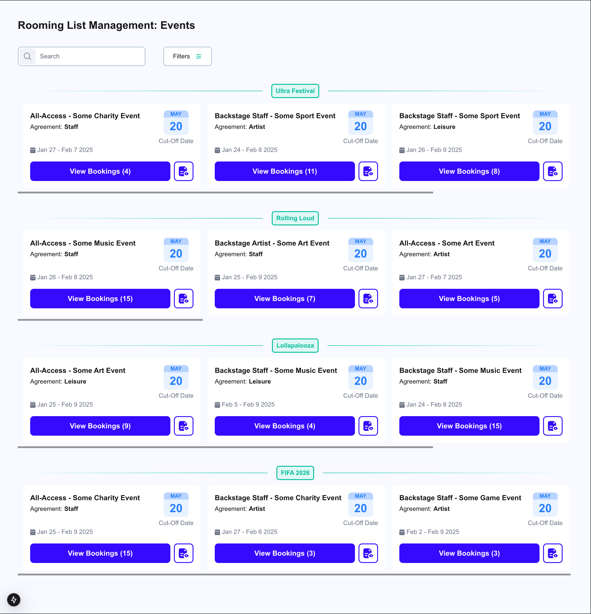

# Rooming List Management

## Getting Started

1. Install dependencies:

```bash
npm install
```

2. Run the development server:

```bash
npm run dev
```

Open [http://localhost:3000](http://localhost:3000) with your browser to see the result.

## Screenshots



> @TODO 🧑‍💻
>
> - improve horizontal scrolling
> - switch colors for each event
> - split components
